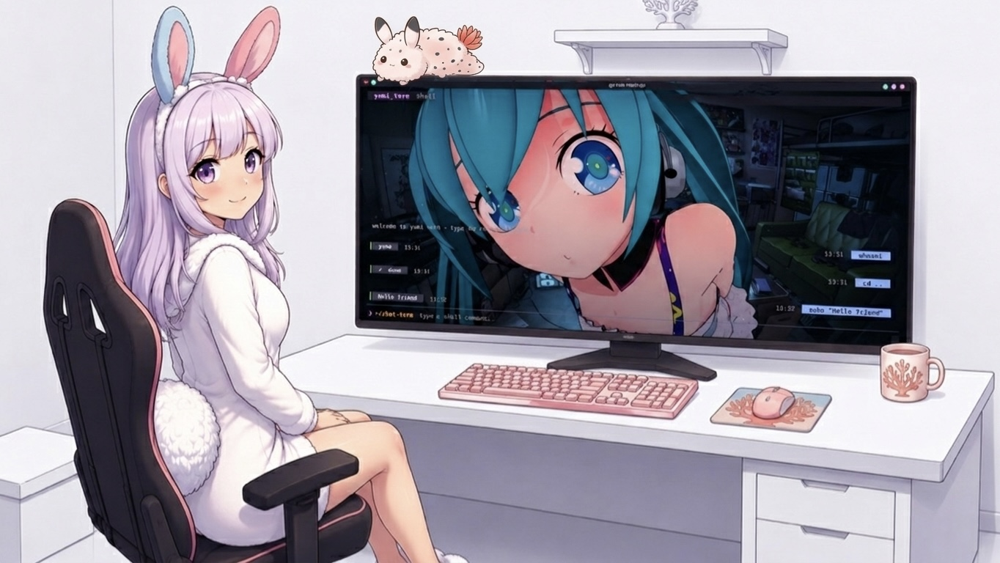

# yumi-term 🌸

> A fresh take on terminal emulators. What if your command line felt like a modern messenger?



**yumi-term** is a minimalist TUI terminal wrapper built with Go and Bubble Tea. It reimagines the classic terminal layout by structuring your session like a chat feed: your commands fly to the right inside clean bubbles, while system responses stay on the left.

## ✨ Features
- **Messenger-like Layout:** Your inputs are on the right, system outputs are on the left.
- **Asynchronous Execution:** Heavy commands won't freeze the UI. Scroll and navigate freely while tasks run in the background.
- **Smart Directory Tracking:** Fully supports `cd` commands and dynamically updates your current working directory in the status bar.
- **Catppuccin Mocha Palette:** Beautiful, eye-friendly pastel colors out of the box.
- **Mouse & Keyboard Scrolling:** Navigate your logs easily with the mouse wheel or `↑`/`↓` arrows.

## 🚀 Quick Start

```bash
go run main.go
```
## 🗺️ Roadmap & Community Support

**yumi-term** is currently an **experimental prototype** (MVP). The ultimate goal is to evolve this concept into a fully-fledged, independent, GPU-accelerated terminal emulator that natively reimagines CLI workflow as a stream-oriented messenger interface.

To bring this idea to life, **I need your support!** Building a complete terminal engine from scratch requires serious community effort. 

### How you can help:
- ⭐ **Leave a star** if you love the concept! It helps the project get noticed.
- 💬 **Open an Issue** to share your thoughts, feature requests, or UI/UX ideas.
- 🛠️ **Contribute:** If you are a Go/Rust developer interested in building next-gen TUI/GUI tools, feel free to fork, discuss, and open Pull Requests.

Let's make terminal navigation comfortable and beautiful together! 🌸
